# BrandPulse System Architecture & UML Diagrams

## Overview
BrandPulse is a comprehensive brand analytics platform that combines AI-powered sentiment analysis, web scraping, and real-time monitoring to provide insights into product perception across multiple channels.

## Table of Contents
- [System Architecture](#system-architecture)
- [Component Overview](#component-overview)
- [Database Design](#database-design)
- [Authentication Flow](#authentication-flow)
- [Web Scraping Pipeline](#web-scraping-pipeline)
- [Data Flow Architecture](#data-flow-architecture)
- [DevOps Pipeline](#devops-pipeline)
- [Infrastructure Architecture](#infrastructure-architecture)
- [UML Class Diagrams](#uml-class-diagrams)
- [Sequence Diagrams](#sequence-diagrams)
- [Deployment Architecture](#deployment-architecture)
- [Technology Stack](#technology-stack)

---

## System Architecture

### Unified High-Level System Overview
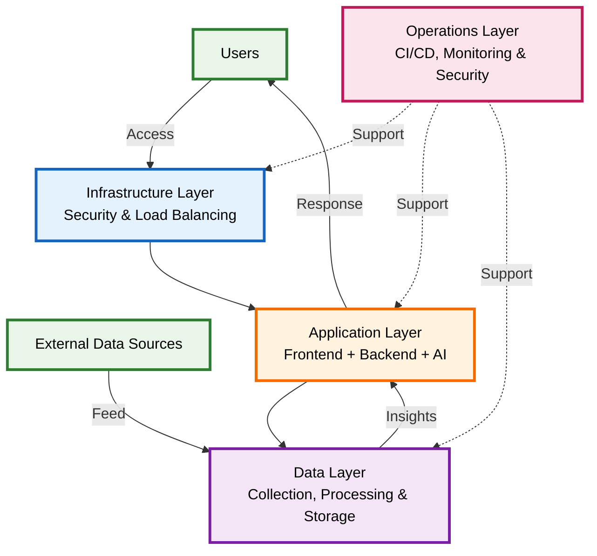

### High-Level Architecture
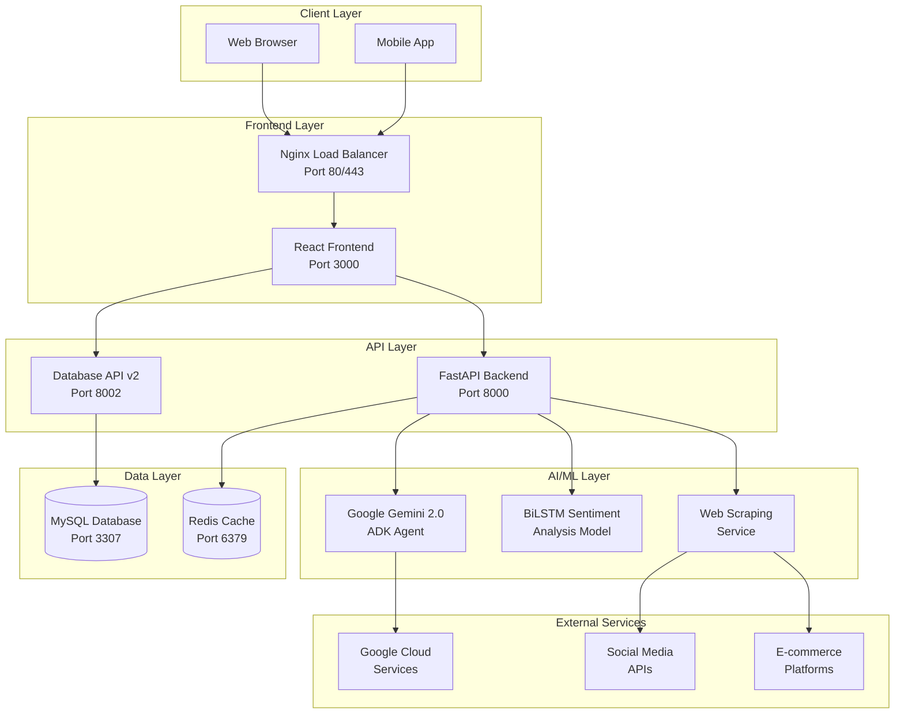

---

## Component Overview

### Frontend Components
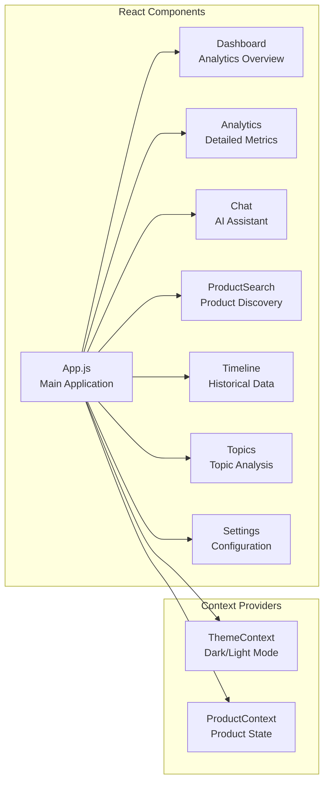

### Backend Services
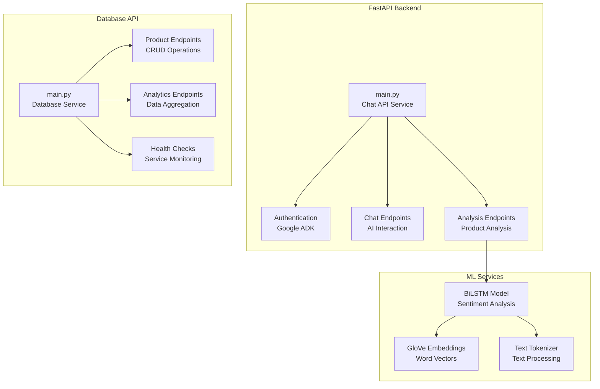

---

## Database Design

### Entity Relationship Diagram
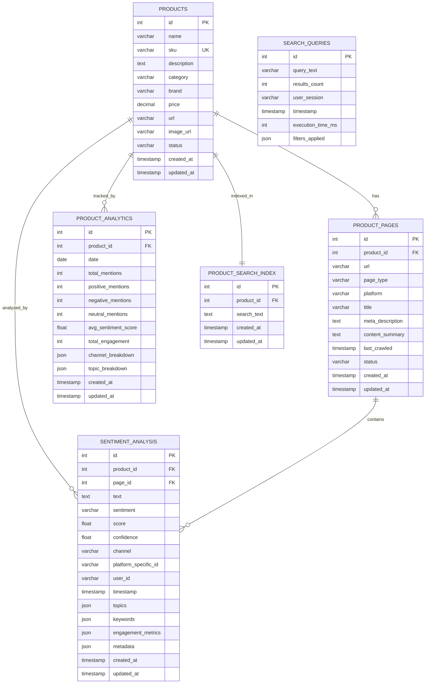

---

## Authentication Flow

### Google ADK Authentication Sequence
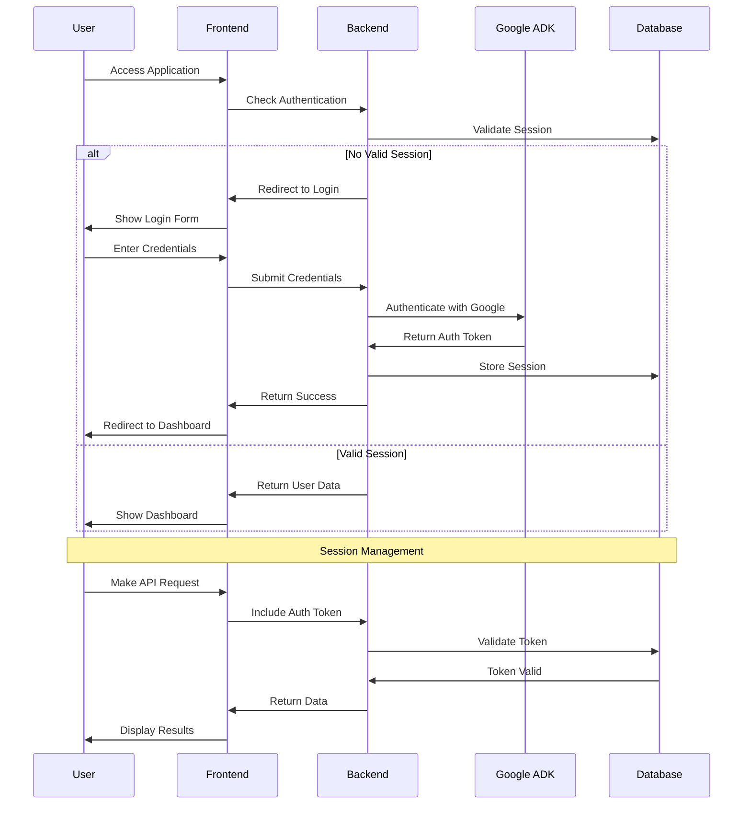

---

## Web Scraping Pipeline

### Data Collection Architecture
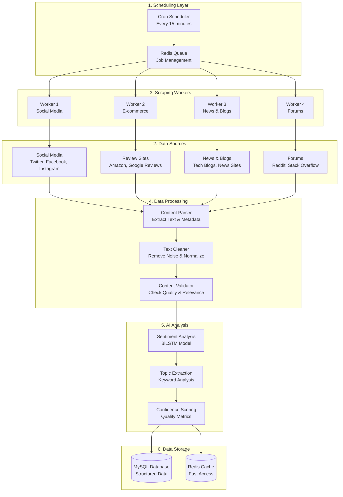

---

## Data Flow Architecture

### Complete Data Flow Diagram
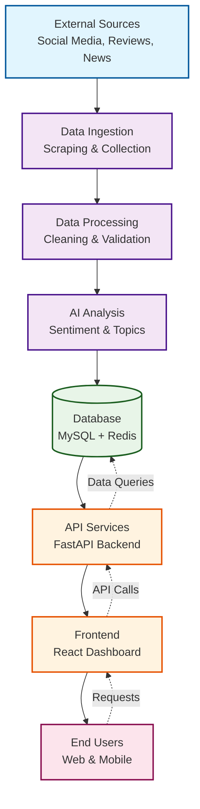

### Data Flow Types

#### 1. **Batch Processing Flow**
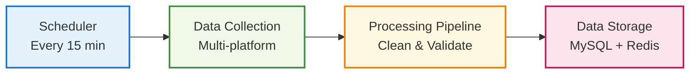

#### 2. **Real-time Processing Flow**
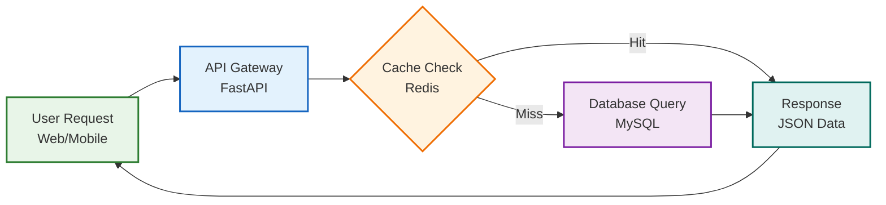

#### 3. **AI Processing Flow**
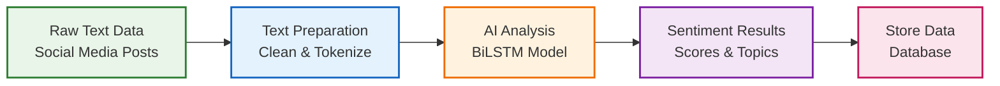

### Data Flow Characteristics

#### **Data Volume & Velocity**
- **Batch Processing:** 10,000+ records every 15 minutes
- **Real-time Processing:** < 100ms response time
- **AI Processing:** 1,000+ texts per minute
- **Cache Hit Rate:** 85%+ for frequently accessed data

#### **Data Quality Pipeline**
1. **Validation:** Content relevance and quality checks
2. **Deduplication:** Remove duplicate entries
3. **Normalization:** Standardize text format
4. **Enrichment:** Add metadata and context
5. **Scoring:** Confidence and quality metrics

#### **Error Handling & Recovery**
- **Retry Logic:** Automatic retry for failed operations
- **Dead Letter Queue:** Handle failed messages
- **Circuit Breaker:** Prevent cascade failures
- **Monitoring:** Real-time error tracking and alerts

---

## DevOps Pipeline

### CI/CD Pipeline Architecture
```mermaid
flowchart LR
    DEV[Developer<br/>Push Code]
    GIT[Git Repository<br/>GitHub/GitLab]
    CI[CI Pipeline<br/>Build & Test]
    TEST[Automated Tests<br/>Unit & Integration]
    BUILD[Build Images<br/>Docker]
    REGISTRY[Container Registry<br/>Docker Hub]
    DEPLOY[Deploy<br/>Production]
    MONITOR[Monitor<br/>Health Check]
    
    DEV --> GIT
    GIT --> CI
    CI --> TEST
    TEST --> BUILD
    BUILD --> REGISTRY
    REGISTRY --> DEPLOY
    DEPLOY --> MONITOR
    MONITOR -.->|Alert| DEV
    
    %% Styling
    classDef developer fill:#e8f5e8,stroke:#2e7d32,stroke-width:2px
    classDef source fill:#e3f2fd,stroke:#1565c0,stroke-width:2px
    classDef cicd fill:#fff3e0,stroke:#ef6c00,stroke-width:2px
    classDef testing fill:#f3e5f5,stroke:#7b1fa2,stroke-width:2px
    classDef deployment fill:#fce4ec,stroke:#c2185b,stroke-width:2px
    classDef monitoring fill:#e0f2f1,stroke:#00695c,stroke-width:2px
    
    class DEV developer
    class GIT source
    class CI,BUILD cicd
    class TEST testing
    class REGISTRY,DEPLOY deployment
    class MONITOR monitoring
```

### DevOps Workflow
```mermaid
flowchart TD
    CODE[Code Commit<br/>Git Push]
    TRIGGER[Trigger CI/CD<br/>Webhook]
    
    subgraph "Build Stage"
        LINT[Code Linting<br/>ESLint, Pylint]
        UNIT[Unit Tests<br/>Jest, Pytest]
        BUILD_APP[Build Application<br/>npm build, pip install]
    end
    
    subgraph "Test Stage"
        INTEGRATION[Integration Tests<br/>API Tests]
        SECURITY[Security Scan<br/>Vulnerability Check]
        COVERAGE[Code Coverage<br/>Report]
    end
    
    subgraph "Deploy Stage"
        BUILD_DOCKER[Build Docker Images<br/>Multi-stage Build]
        PUSH_REGISTRY[Push to Registry<br/>Tag & Version]
        DEPLOY_PROD[Deploy Production<br/>Rolling Update]
    end
    
    subgraph "Monitor Stage"
        HEALTH[Health Checks<br/>Service Status]
        METRICS[Metrics Collection<br/>Prometheus]
        ALERTS[Alert System<br/>Slack/Email]
    end
    
    CODE --> TRIGGER
    TRIGGER --> LINT
    LINT --> UNIT
    UNIT --> BUILD_APP
    
    BUILD_APP --> INTEGRATION
    INTEGRATION --> SECURITY
    SECURITY --> COVERAGE
    
    COVERAGE --> BUILD_DOCKER
    BUILD_DOCKER --> PUSH_REGISTRY
    PUSH_REGISTRY --> DEPLOY_PROD
    
    DEPLOY_PROD --> HEALTH
    HEALTH --> METRICS
    METRICS --> ALERTS
    
    %% Styling
    classDef codeStage fill:#e8f5e8,stroke:#2e7d32,stroke-width:2px
    classDef buildStage fill:#e3f2fd,stroke:#1565c0,stroke-width:2px
    classDef testStage fill:#fff3e0,stroke:#ef6c00,stroke-width:2px
    classDef deployStage fill:#f3e5f5,stroke:#7b1fa2,stroke-width:2px
    classDef monitorStage fill:#fce4ec,stroke:#c2185b,stroke-width:2px
    
    class CODE,TRIGGER codeStage
    class LINT,UNIT,BUILD_APP buildStage
    class INTEGRATION,SECURITY,COVERAGE testStage
    class BUILD_DOCKER,PUSH_REGISTRY,DEPLOY_PROD deployStage
    class HEALTH,METRICS,ALERTS monitorStage
```

### Container Orchestration
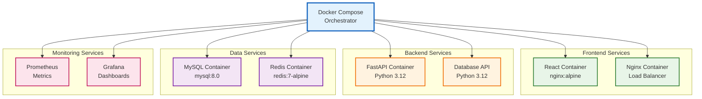

---

## Infrastructure Architecture

### Cloud Infrastructure Overview
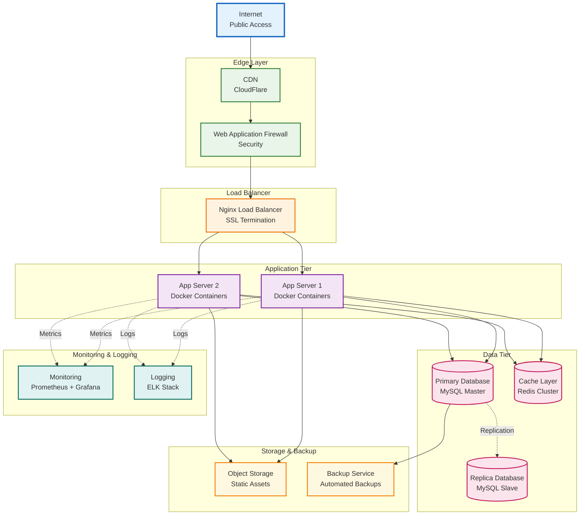

### Network Architecture
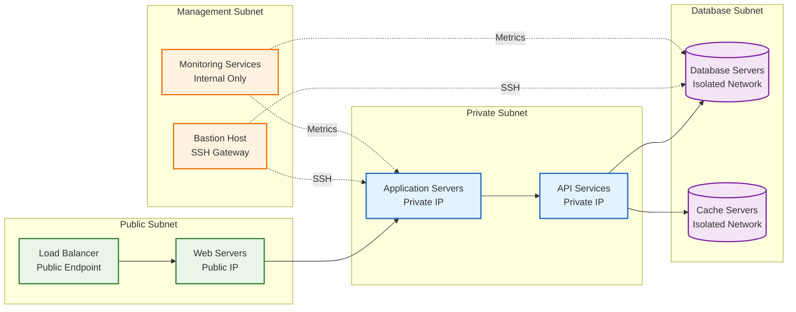

### Security Architecture
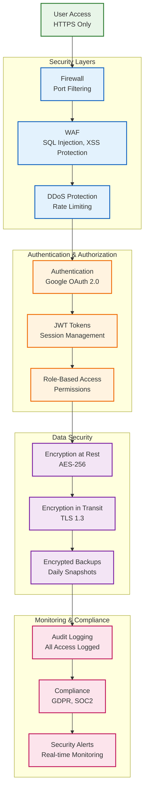

---

## UML Class Diagrams

### Frontend Component Architecture
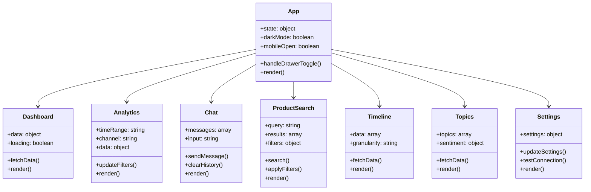

### Backend API Architecture
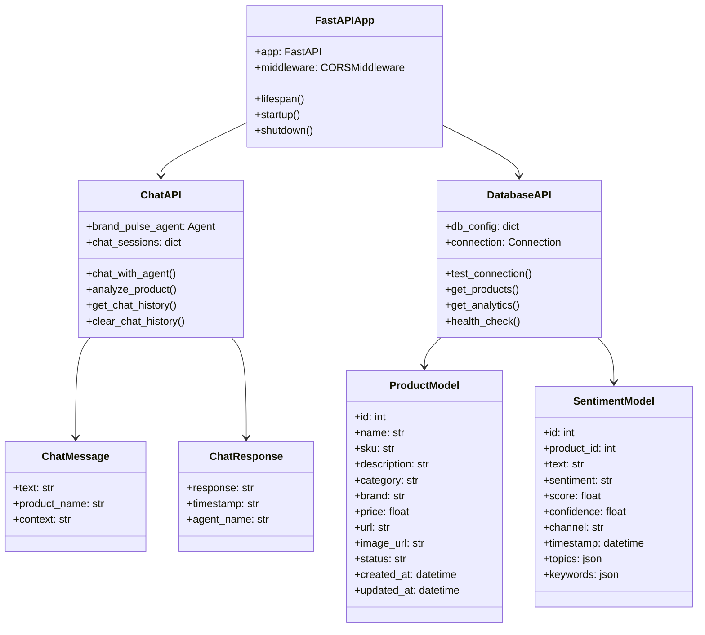

### ML Model Architecture
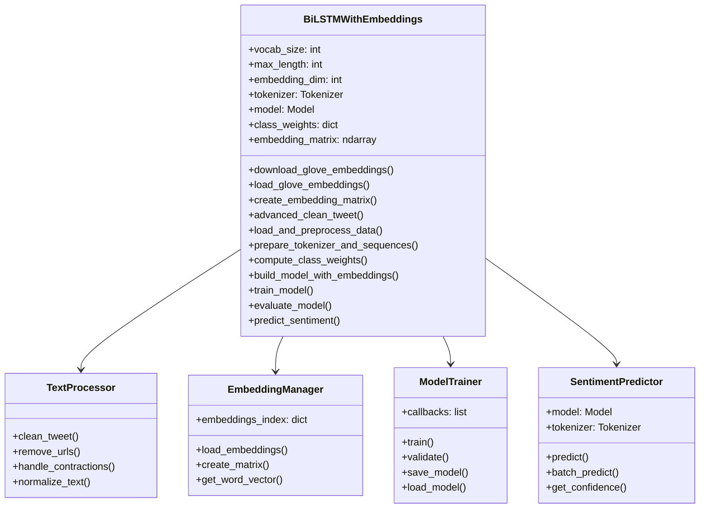

---

## Sequence Diagrams

### Product Analysis Flow
```mermaid
sequenceDiagram
    participant U as User
    participant F as Frontend
    participant B as Backend
    participant G as Google ADK
    participant M as ML Model
    participant D as Database
    participant S as Scraper
    
    U->>F: Search Product
    F->>B: GET /api/products/search
    B->>D: Query Products
    D->>B: Return Results
    B->>F: Product List
    
    U->>F: Select Product
    F->>B: GET /api/products/{id}/sentiment
    B->>D: Query Sentiment Data
    D->>B: Return Sentiment
    B->>F: Sentiment Analysis
    
    U->>F: Request AI Analysis
    F->>B: POST /api/analyze/product
    B->>G: Send Product Info
    G->>B: AI Analysis
    B->>F: Analysis Results
    
    U->>F: Request Real-time Data
    F->>B: POST /api/scrape/update
    B->>S: Trigger Scraping
    S->>S: Scrape Social Media
    S->>M: Process Text
    M->>S: Sentiment Scores
    S->>D: Store Results
    D->>B: Updated Data
    B->>F: Fresh Analysis
    F->>U: Updated Dashboard
```

### Chat Interaction Flow
```mermaid
sequenceDiagram
    participant U as User
    participant F as Frontend
    participant B as Backend
    participant G as Google ADK
    participant D as Database
    
    U->>F: Send Chat Message
    F->>B: POST /api/chat
    B->>G: Process with Gemini
    G->>B: AI Response
    B->>D: Store Chat History
    D->>B: Confirmation
    B->>F: Chat Response
    F->>U: Display Response
    
    U->>F: Request Product Analysis
    F->>B: POST /api/analyze/product
    B->>D: Get Product Data
    D->>B: Product Info
    B->>G: Analyze Product
    G->>B: Comprehensive Analysis
    B->>F: Analysis Results
    F->>U: Show Analysis
    
    U->>F: Clear Chat History
    F->>B: DELETE /api/chat/history
    B->>D: Clear Session
    D->>B: Confirmation
    B->>F: Success Response
    F->>U: Chat Cleared
```

---

## Deployment Architecture

### Production Environment
```mermaid
graph TD
    subgraph "Client Layer"
        USER[Users<br/>Web Browser<br/>Mobile App]
    end
    
    subgraph "Load Balancer Layer"
        LB[Nginx<br/>Port 80/443<br/>SSL & Load Balancing]
    end
    
    subgraph "Application Layer"
        FE[React Frontend<br/>Port 3000<br/>User Interface]
        API[FastAPI Backend<br/>Port 8000<br/>Chat & AI Services]
        DBAPI[Database API<br/>Port 8002<br/>Data Operations]
    end
    
    subgraph "AI Services Layer"
        AI[Google Gemini 2.0<br/>ADK Agent<br/>Natural Language]
        ML[BiLSTM Model<br/>Sentiment Analysis<br/>Real-time Processing]
    end
    
    subgraph "Data Layer"
        DB[(MySQL Database<br/>Port 3307<br/>Primary Data Store)]
        CACHE[(Redis Cache<br/>Port 6379<br/>Sessions & Cache)]
    end
    
    USER -->|HTTPS| LB
    LB -->|Static Files| FE
    FE -->|API Calls| API
    FE -->|Data Requests| DBAPI
    API -->|AI Requests| AI
    API -->|ML Processing| ML
    API -->|Cache Access| CACHE
    DBAPI -->|Queries| DB
    DBAPI -->|Cache Operations| CACHE
```

---

## Technology Stack

### Frontend Technologies
- **React 18** - Modern UI framework with hooks and concurrent features
- **Material-UI** - Comprehensive component library
- **Framer Motion** - Advanced animations and transitions
- **Axios** - HTTP client with interceptors
- **React Router** - Client-side routing

### Backend Technologies
- **FastAPI** - Modern Python web framework with automatic API documentation
- **Pydantic** - Data validation and serialization
- **Uvicorn** - High-performance ASGI server
- **CORS** - Cross-origin resource sharing middleware

### Database Technologies
- **MySQL 8.0** - Primary relational database with JSON support
- **Redis** - In-memory data store for caching and sessions
- **PyMySQL/MySQL Connector** - Database drivers for Python

### AI/ML Technologies
- **Google ADK** - AI agent development framework
- **Gemini 2.0 Flash** - Large language model for natural language processing
- **TensorFlow/Keras** - Deep learning framework
- **BiLSTM** - Bidirectional LSTM for sentiment analysis
- **GloVe Embeddings** - Pre-trained word vector representations

### Infrastructure Technologies
- **Docker** - Containerization platform
- **Docker Compose** - Multi-container application orchestration
- **Nginx** - Load balancer and reverse proxy
- **Linux** - Operating system
---

## Key Features

### 🔐 **Authentication & Security**
- Google ADK Agent authentication
- JWT token management
- OAuth 2.0 integration
- Multi-layer security architecture
- SSL/TLS encryption

### 🕷️ **Web Scraping Capabilities**
- Multi-platform scraping (Twitter, Facebook, Instagram, Amazon, etc.)
- Content parsing and cleaning pipeline
- Quality control and deduplication
- Real-time data processing
- Sentiment analysis integration

### 🤖 **AI/ML Components**
- Google Gemini 2.0 Flash integration
- BiLSTM sentiment analysis model
- GloVe embeddings
- Multi-task learning (sentiment + sarcasm detection)
- Real-time text processing

### 🏗️ **System Architecture**
- Microservices architecture
- Docker containerization
- Load balancing with Nginx
- MySQL primary/replica setup
- Redis caching layer
- Comprehensive monitoring stack

---

---

## System Flow Diagram

### Complete Data Flow & Process Architecture
```mermaid
flowchart TD
    subgraph "1. User Interface Layer"
        UI[User Interface<br/>React Frontend]
        DASH[Dashboard<br/>Analytics View]
        CHAT[Chat Interface<br/>AI Assistant]
        SEARCH[Product Search<br/>Discovery Tool]
    end
    
    subgraph "2. API Gateway Layer"
        NGINX[Nginx Load Balancer<br/>Port 80/443]
        AUTH[Authentication<br/>Google ADK]
        CORS[CORS Middleware<br/>Cross-Origin]
    end
    
    subgraph "3. Application Services Layer"
        CHATAPI[Chat API Service<br/>Port 8000]
        DBAPI[Database API Service<br/>Port 8002]
        SCRAPER[Web Scraping Service<br/>Background Jobs]
    end
    
    subgraph "4. AI/ML Processing Layer"
        GEMINI[Google Gemini 2.0<br/>ADK Agent]
        BILSTM[BiLSTM Model<br/>Sentiment Analysis]
        EMBEDDINGS[GloVe Embeddings<br/>Word Vectors]
        PROCESSOR[Text Processor<br/>Cleaning & Normalization]
    end
    
    subgraph "5. Data Sources Layer"
        SOCIAL[Social Media<br/>Twitter, Facebook, Instagram]
        REVIEWS[Review Platforms<br/>Amazon, Google Reviews]
        NEWS[News & Blogs<br/>Tech Sites, News]
        FORUMS[Forums<br/>Reddit, Stack Overflow]
    end
    
    subgraph "6. Data Storage Layer"
        MYSQL[(MySQL Database<br/>Port 3307<br/>Primary Storage)]
        REDIS[(Redis Cache<br/>Port 6379<br/>Sessions & Cache)]
        FILES[File Storage<br/>Models & Assets]
    end
    
    subgraph "7. External Services Layer"
        GOOGLE[Google Cloud<br/>Services & APIs]
        CDN[Content Delivery<br/>Network]
        MONITOR[Monitoring<br/>Health Checks]
    end
    
    %% User Interactions
    UI --> DASH
    UI --> CHAT
    UI --> SEARCH
    
    %% API Gateway Flow
    DASH --> NGINX
    CHAT --> NGINX
    SEARCH --> NGINX
    NGINX --> AUTH
    AUTH --> CORS
    
    %% Service Routing
    CORS --> CHATAPI
    CORS --> DBAPI
    
    %% Chat Service Flow
    CHATAPI --> GEMINI
    CHATAPI --> REDIS
    CHATAPI --> MYSQL
    
    %% Database Service Flow
    DBAPI --> MYSQL
    DBAPI --> REDIS
    DBAPI --> MONITOR
    
    %% Scraping Service Flow
    SCRAPER --> SOCIAL
    SCRAPER --> REVIEWS
    SCRAPER --> NEWS
    SCRAPER --> FORUMS
    
    %% AI/ML Processing Flow
    SOCIAL --> PROCESSOR
    REVIEWS --> PROCESSOR
    NEWS --> PROCESSOR
    FORUMS --> PROCESSOR
    
    PROCESSOR --> BILSTM
    BILSTM --> EMBEDDINGS
    BILSTM --> MYSQL
    
    %% External Service Integration
    GEMINI --> GOOGLE
    CHATAPI --> CDN
    DBAPI --> MONITOR
    
    %% Data Flow Styling
    classDef userLayer fill:#e1f5fe
    classDef apiLayer fill:#f3e5f5
    classDef serviceLayer fill:#e8f5e8
    classDef aiLayer fill:#fff3e0
    classDef dataLayer fill:#fce4ec
    classDef storageLayer fill:#f1f8e9
    classDef externalLayer fill:#e0f2f1
    
    class UI,DASH,CHAT,SEARCH userLayer
    class NGINX,AUTH,CORS apiLayer
    class CHATAPI,DBAPI,SCRAPER serviceLayer
    class GEMINI,BILSTM,EMBEDDINGS,PROCESSOR aiLayer
    class SOCIAL,REVIEWS,NEWS,FORUMS dataLayer
    class MYSQL,REDIS,FILES storageLayer
    class GOOGLE,CDN,MONITOR externalLayer
```

### Real-Time Data Processing Flow
```mermaid
sequenceDiagram
    participant U as User
    participant F as Frontend
    participant N as Nginx
    participant C as Chat API
    participant D as Database API
    participant G as Gemini AI
    participant S as Scraper
    participant M as ML Model
    participant DB as MySQL
    participant R as Redis
    
    Note over U,R: User Initiates Product Analysis
    
    U->>F: Search for Product
    F->>N: GET /api/products/search
    N->>D: Forward Request
    D->>R: Check Cache
    R->>D: Cache Miss
    D->>DB: Query Products
    DB->>D: Return Results
    D->>R: Cache Results
    D->>N: Product List
    N->>F: Response
    F->>U: Display Products
    
    Note over U,R: AI Analysis Request
    
    U->>F: Request AI Analysis
    F->>N: POST /api/analyze/product
    N->>C: Forward Request
    C->>G: Send Product Context
    G->>C: AI Analysis
    C->>DB: Store Analysis
    C->>N: Analysis Results
    N->>F: Response
    F->>U: Show Analysis
    
    Note over U,R: Real-Time Data Update
    
    U->>F: Request Fresh Data
    F->>N: POST /api/scrape/update
    N->>S: Trigger Scraping
    S->>S: Scrape Social Media
    S->>M: Process Text Data
    M->>S: Sentiment Scores
    S->>DB: Store Results
    S->>R: Update Cache
    DB->>D: Data Updated
    D->>N: Fresh Data
    N->>F: Updated Analysis
    F->>U: Real-Time Dashboard
```

### System Monitoring & Health Flow
```mermaid
flowchart LR
    subgraph "Health Monitoring"
        HEALTH[Health Check Service]
        METRICS[System Metrics]
        ALERTS[Alert System]
    end
    
    subgraph "Service Status"
        CHATSTATUS[Chat API Status]
        DBSTATUS[Database API Status]
        MLSTATUS[ML Model Status]
        SCRAPERSTATUS[Scraper Status]
    end
    
    subgraph "Performance Metrics"
        CPU[CPU Usage]
        MEMORY[Memory Usage]
        DISK[Disk Usage]
        NETWORK[Network I/O]
    end
    
    subgraph "External Monitoring"
        UPTIME[Uptime Monitoring]
        LOGS[Log Aggregation]
        DASHBOARD[Monitoring Dashboard]
    end
    
    HEALTH --> CHATSTATUS
    HEALTH --> DBSTATUS
    HEALTH --> MLSTATUS
    HEALTH --> SCRAPERSTATUS
    
    CHATSTATUS --> METRICS
    DBSTATUS --> METRICS
    MLSTATUS --> METRICS
    SCRAPERSTATUS --> METRICS
    
    METRICS --> CPU
    METRICS --> MEMORY
    METRICS --> DISK
    METRICS --> NETWORK
    
    CPU --> ALERTS
    MEMORY --> ALERTS
    DISK --> ALERTS
    NETWORK --> ALERTS
    
    ALERTS --> UPTIME
    ALERTS --> LOGS
    UPTIME --> DASHBOARD
    LOGS --> DASHBOARD
```

---

This architecture documentation provides a complete technical overview of the BrandPulse system, enabling developers, architects, and stakeholders to understand the system's structure, data flows, and capabilities.